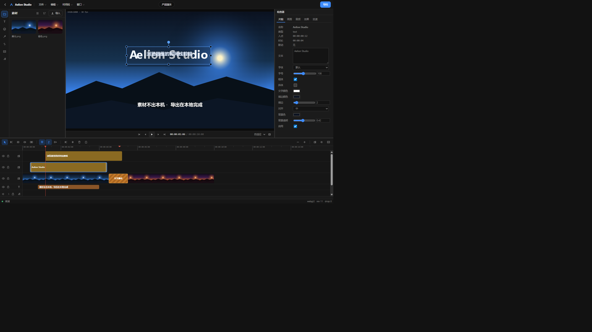
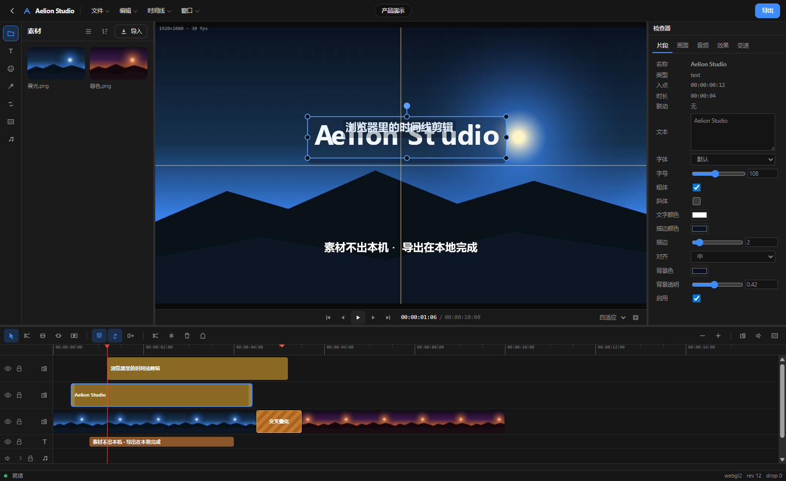
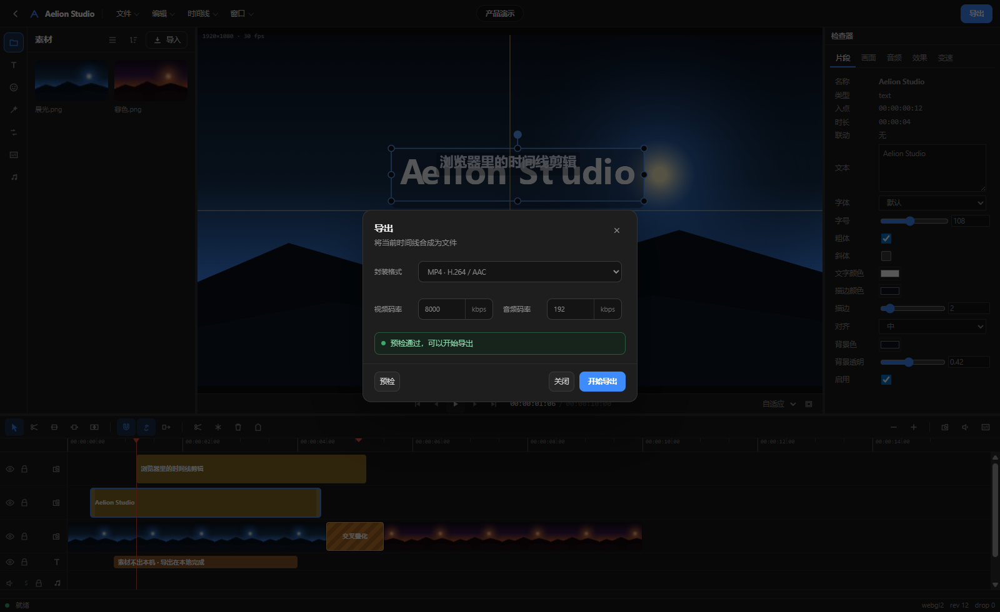

<div align="center">

# Aelion Studio

**打开浏览器就能剪的专业时间线剪辑器。**

素材不上传，导出不排队，工程留在你自己的机器上。

[English](README.md) · **简体中文**

[](https://studio.aelion.chat)
[](LICENSE)
[](https://github.com/FoyonaCZY/AelionStudio/releases/tag/v0.1.0)
[](https://github.com/FoyonaCZY/AelionSDK)
[](#快速开始)
[](#素材不出本机)

</div>

---

Aelion Studio 是一个完整跑在浏览器标签页里的视频剪辑器。多轨时间线、画面变换、字幕、调音、变速、转场、效果，以及**在本机直接编码 MP4** —— 没有渲染服务器，没有上传等待，没有导出队列。

**0.1.0** 是第一个公开版本，基于 AelionSDK **2.0.0**，工程文件使用 Project v2 Schema。

页面加载完成之后，从剪辑到导出的全过程**不产生任何网络请求**。

**在线体验：** [studio.aelion.chat](https://studio.aelion.chat) —— 同一份应用，不用安装。素材仍然只留在你的浏览器里。

<p align="center">
  
</p>
<p align="center">
  
</p>
<p align="center">
  
</p>

## 为什么不一样

### 素材不出本机

大多数网页剪辑器要先把素材传上去。4 GB 的源文件意味着你要等半小时才能剪第一刀，还得把未公开的片子交给别人保管。

Aelion Studio 不传。源文件写进浏览器的 **OPFS**（源私有文件系统），工程状态存进 **IndexedDB**，解码、合成、编码全部发生在你自己的 CPU 和 GPU 上。**这个应用完全没有后端。** 部署出去的就是一个静态文件夹。

对需要处理未公开素材、客户内容或受合规约束资料的人，这不是一个特性，这是准入条件。

### 导出用你自己的显卡跑完

**WebCodecs** 直接驱动系统的硬件编码器：

| 视频 | 音频 | 图像 |
| --- | --- | --- |
| MP4 · H.264 / AAC | WAV · PCM | 当前帧 PNG |
| MP4 · HEVC / AAC | | 当前帧 JPEG |
| MP4 · AV1 / AAC | | 当前帧 WebP |
| WebM · VP9 / Opus | | GIF |

每次导出都先做一步**能力预检**：问浏览器和显卡到底能不能干这活。答案是否定的，你当场就知道 —— 不是等到 90% 才知道。

### 帧级精确，而且是确定性的

底层是 [AelionSDK](https://github.com/FoyonaCZY/AelionSDK)，一套围绕「精确」构建的引擎：精确 seek、规范化工程文档、带修订号的事务化编辑。

落到你能感觉到的地方：一次拖动就是一次事务，所以撤销真的会回到上一个状态；播放头停在第 137 帧，导出的第 137 帧就是你刚才看到的那一帧。

---

## 功能

### 导入

把文件拖进窗口、拖到指定轨道，或从菜单里选。也支持**从 URL 导入**，只要对方支持 HTTP Range。

| | |
| --- | --- |
| **视频** | MP4 · WebM · MOV · MKV · MPEG-TS |
| **音频** | 从上述容器解出的音轨，以及独立音频文件 |
| **图片** | PNG · JPEG · WebP · GIF · BMP · AVIF · SVG |
| **字幕** | SRT · WebVTT |

含视音频的文件会拆成两段并建立联动 —— 动其中一段，另一段跟着走。素材同时缓存进 OPFS，重开工程不会再让你重新找文件。

### 时间线

- 多轨编辑，视频 / 字幕 / 音频轨可随时增删；新建工程默认 V1–V3 · C1 · A1–A2
- 五种工具：**选择**、**剃刀**、**滑移**、**滑动**、**滚动**
- 吸附、视音频联动、波纹编辑，三者独立开关
- 跨轨拖动自动处理碰撞；拖到已占用的位置，两段会交换并重新排布
- 音频轨绘制波形，视频轨绘制缩略图胶片
- 标记打点，以及每条轨道的静音 / 独奏 / 锁定 / 隐藏
- 完整撤销重做，一整次拖动合并为一条历史

### 画面

- 在监视器里**直接拖拽**移动、缩放、旋转 —— 八个控制柄加一个旋转柄
- 智能吸附到画面中心、三分线、边缘，以及其它图层的边界与中心，命中时画出参考线
- `Shift` 解除等比，`Alt` 临时关闭吸附，旋转按 90° 吸附
- 不透明度、缩放、位置、旋转、适配方式（适应 / 铺满 / 拉伸 / 原始）、混合模式
- 安全框，以及预览画质切换（自适应 / 草稿 / 全画质）

### 文字与字幕

- 标题与副标题图层：字体、字号、粗细、斜体、颜色、描边、对齐，以及**背景色块**
- 独立字幕轨，导入导出 **SRT** 与 **WebVTT**
- 选框贴合实际字形，而不是一个松垮的外接矩形

### 图形与生成

矩形、椭圆、纯色色块、线性渐变，以及**调整图层** —— 效果作用于其下所有图层。

### 效果与转场

八种效果：亮度、对比度、饱和度、黑白、棕褐、色相、反相、模糊 —— 全部可调强度，实时预览。

五种转场：交叉叠化、左 / 右滑入、闪黑、闪白。拖到接头上，拖两边改时长。

### 音频

- 增益、声像、淡入淡出，以及变速时是否保持音高
- **响度分析**，给出 LUFS 与真峰值（dBTP）
- **静音检测**，可一键移除
- **节拍检测**自动打点，用来卡点
- **能量切点检测**，帮你找素材的自然分段

### 变速

0.1×–4× 无级变速、倒放，以及在出点**定格**两秒。

### 工程管理

- 工程主页：搜索、排序、网格或列表
- 编辑过程自动保存 —— 关掉标签页再回来，素材和进度都还在
- 预设：1080p 16:9（30/60 fps）、9:16 竖屏、1:1 方形、4K
- 工程可导出为规范化 JSON 文档，便于存档、迁移或接入流水线

### 快捷键

| | | | |
| --- | --- | --- | --- |
| `Space` 播放 / 暂停 | `K` / `L` 暂停 / 播放 | `S` 分割 | `M` 打点 |
| `V` 选择 | `C` 剃刀 | `Y` 滑移 | `U` 滑动 |
| `N` 滚动 | `←` `→` 逐帧（`Shift` 十帧） | `Home` `End` 起止 | `+` `-` 缩放 |
| `Del` 删除 | `Ctrl+Z` 撤销 | `Ctrl+Y` 重做 | `Ctrl+滚轮` 时间线缩放 |

---

## 快速开始

托管演示在 **[studio.aelion.chat](https://studio.aelion.chat)**。想先用就打开它；只有要本地跑或改代码时才需要克隆。

Studio 是自包含的。它依赖已发布的 `@aelionsdk/*` 包，因此在任何地方都能装、能构建。

```bash
git clone https://github.com/FoyonaCZY/AelionStudio.git
cd AelionStudio
pnpm install --frozen-lockfile
```

### 开发

```bash
pnpm dev
```

打开 <http://127.0.0.1:4174/>。开发服务器已经带上了跨源隔离所需的响应头。

### 构建与部署

```bash
pnpm build        # 静态产物在 dist/
pnpm preview      # 在 :4180 本地预览 dist/
```

产物是纯静态文件，Vercel、Netlify、Nginx 或对象存储都能直接托管。

**建议**让你的托管发送这两个响应头：

```
Cross-Origin-Opener-Policy: same-origin
Cross-Origin-Embedder-Policy: require-corp
```

它们会开启跨源隔离，让音频走低延迟的 `SharedArrayBuffer` 环形缓冲。**不加也能用** —— 会回退到基于 postMessage 的播放路径，延迟略高。

### 对着本地 SDK 源码开发

Studio 可以克隆到 AelionSDK 检出目录下作为 `apps/editor-demo`，并且仍然独立安装 —— 因为它自己持有 pnpm 工作区边界。两种方式下它都解析已发布的 SDK 包。

如果要对着本地 SDK 改动测试，先构建一次 SDK，再把 Studio 直接依赖的四个包 link 过去（以下路径假设 Studio 位于 `apps/editor-demo`）：

```bash
cd ../..            # AelionSDK 根目录
corepack pnpm install --frozen-lockfile
corepack pnpm run build

cd apps/editor-demo
pnpm link ../../packages/core
pnpm link ../../packages/project-schema
pnpm link ../../packages/sdk
pnpm link ../../packages/export
```

跑一次 `pnpm install` 即可恢复成已发布的包。

---

## 浏览器支持

Studio 依赖 **WebCodecs**、**WebGL2**、**OPFS** 和 **AudioWorklet**。

| 浏览器 | 状态 |
| --- | --- |
| Chrome / Edge (Chromium) | ✅ 主要目标 |
| Firefox | ⚠️ 可编辑与预览；导出取决于 `VideoEncoder` 的可用性 |
| Safari / iOS / Android | ❌ 尚未认证 |

底层引擎在 CI 中对 Chromium 与 Firefox 做冒烟验证。目前体验最完整的是桌面版 Chrome 或 Edge。

---

## 现在还做不到

写在前面，好过让你自己撞上：

- **没有代理（proxy）流程。** 预览按素材原始分辨率解码，4K 素材对普通配置的机器压力不小。
- **单序列。** 引擎支持嵌套序列，界面还没开放。
- **仅 SDR。** 本地颜色链路是 RGBA8，HDR 与 10-bit 会明确失败，而不是错误呈现。
- **字幕格式。** 支持 SRT 与 WebVTT，不支持 ASS/SSA。
- **无协作。** 单人单机，没有云端同步。
- **界面仅中文。**
- **无关键帧动画。** 变换与效果在整段片段内保持单一值。

---

## 架构

Studio 0.1.0 严格构建在 [`@aelionsdk/sdk`](https://github.com/FoyonaCZY/AelionSDK) 与 `@aelionsdk/export` 的 **2.0 公开入口**之上 —— 没有私有 API，没有补丁。你在这里看到的一切，都可以用同一套接口构建进你自己的产品。

```
Aelion Studio  ·  原生 TypeScript，无框架
        │
        ├── @aelionsdk/sdk        会话、时间线事务、播放器、预览
        └── @aelionsdk/export     WebCodecs 编码与封装
                    │
                    ├── WebGL2 / WebGPU 合成器（在 Worker 内）
                    ├── WebCodecs 解码 + 精确 seek
                    └── AudioWorklet 时钟与混音
```

界面层是不带框架的 TypeScript：事件委托 + 定向重绘。渲染、解码、编码全部在 Worker 与 GPU 上，主线程只留给 UI。

---

## 许可

[MIT](LICENSE) © 2026 FoyonaCZY and Aelion Studio contributors
